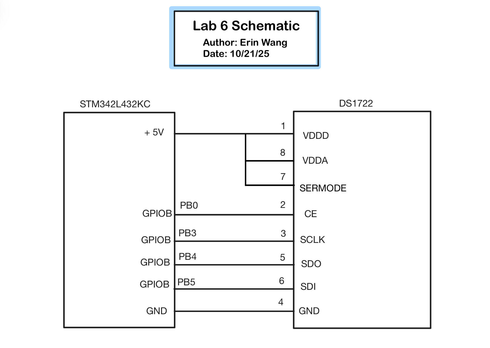
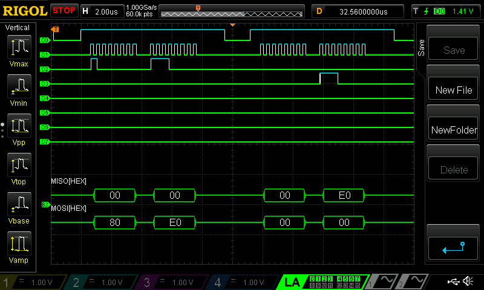
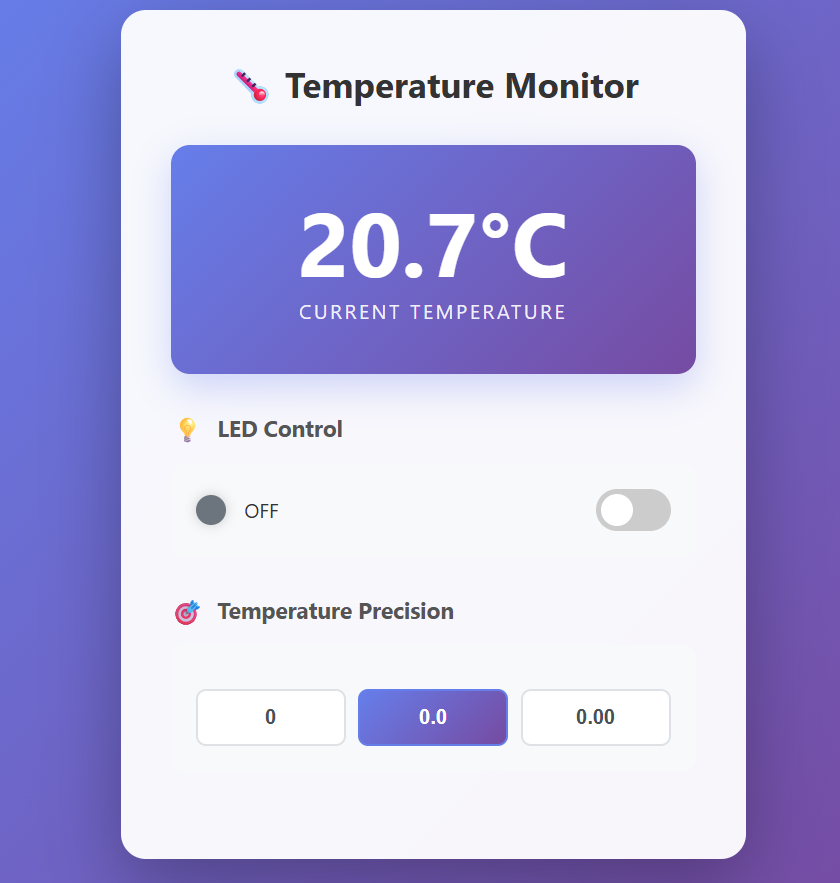

## Lab Hours
I spent 45 hours on this lab.

## Introduction
Lab 6 involved learning how to use the SPI and UART interface to interact with a DS1722 temperature sensor and upload the temperature data onto an HTML website. The lab also included allowing users to choose temperature resolution through the website.   

## Design and Testing Methodology

### Choosing Baud Rate
The DS1722 has a maximum input SCLK frequency of 5.0 MHz. Because the MCU SPI is running at 80 MHz and the baud rate divides the clock as follows:

$$
SCLK_{freq} = \frac{SPI}{2^{BR+1}}
$$

I chose a BR = 4 for a SCLK frequency of 2.5 MHz. 

### Calculating Temperature
The `MSB` of the temperature is formatted in two's complement. To convert to decimal, I checked whether the value was negative (the most significant bit is 1), and if so I inverted the bits then added one and cast the negative of the result to a double. If the value was positive (the most significant bit is 0) then I simply cast the value to a double. 

The `LSB` of the temperature is in fractions or negative powers of two. So I scanned from the least significant bit to the most significant bit and calculated the appropriate negative power of two before adding the results from each bit together. 

The final temperature is the decimal version of the `MSB` and the `LSB` added together. 

## Technical Documentation
The source code for the project can be found in the associated [Github repository](https://github.com/erinlywang/e155-lab6)

## Schematic
{#fig-schematic}

@fig-schematic shows the physical layout of the design. The GPIOB pin PB0 was chosen for the chip enable `CE` since it does not interact with the other peripherals. GPIOB pins PB3, PB4, and PB5 were chosen from the datasheet for the alternate functions of `SCLK`, `MISO`, and `MOSI` respectively. 

## Results and Discussion

### Logic Analyzer: SPI Transaction (a Write and a Read)

{#fig-decoder}

@fig-decoder shows the transaction for a write to the DS1722 configuration register and a read from the DS1722 configuration register on the Logic Analyzer including the SPI decoding. It can be seen that the value written to the register matches that read from the register. 

## Conclusion

The design successfully outputs the temperature onto the website and increases with higher temperatures as well as decreases to lower temperatures. The nominal value seems to be around 27 degrees C, which is notably a little high for room temperature (22 degrees C). The resolution also changes with the input buttons with 8-bit having the smallest resolution and 12-bit having the largest resolution. The LED buttons toggle the LED and update the state on the website.

Overall I'd deem this lab a success! However, I'd love to get some insight into some of the struggles I had where when writing the last four bits of the configuration register, whenever I'd read back from the configuration register it would be shifted (say I write 0xE2, then I'd read 0xE4). I was able to counteract this in my function to set the temperature resolution, but I was wondering where that issue might have come from. 

## AI Prototype and Reflection

On Claude, after typing in the prompt, it actually ran the HTML for me with a really cool looking website (see @fig-aihtml)!

{#fig-aihtml}

The temperature was around what room temperature is (22-24°C) which is reasonable. I really like the layout and how quickly the temperature changed. I liked how the LED on/off wasn't just a button but a slider and that the OFF symbol would glow when the slider was flipped to "ON". I also thought the emojis and theming of the overall HTML was really nice and easy to follow. I like how resolution was about decimal places rather than a "bit" which is more user friendly. 

The second prompt put a really big delay between readings which I found doesn't work very well with the SPI interface and the temperature readings were stuck at 0.000000 (which is quite chilly in my opinion). The code itself seemed quite reasonable, but was much shorter than my code and also didn't include the UART interface. The code did not work for this prompt nor did any goading get it closer. 